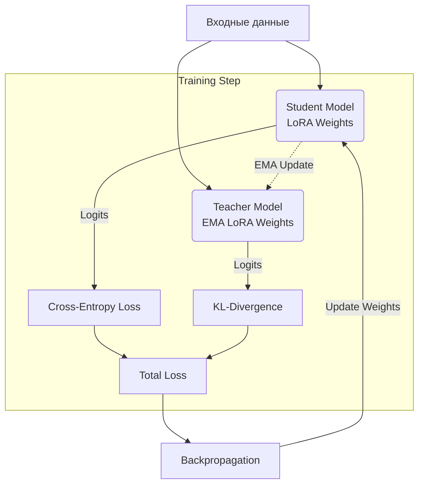

# TemaTrainer

**TemaTrainer** — это экспериментальный класс для дообучения больших языковых моделей (LLM), реализующий подход **Teacher Exponential Moving Average (TEMA)**. Данный метод предназначен для регуляризации процесса обучения и снижения эффекта *catastrophic forgetting* (катастрофического забывания) при последовательном (continual) fine-tuning на доменно-специфичных данных.

Реализация построена как расширение библиотеки `trl` (класс `SFTTrainer`) и оптимизирована для сценариев **PEFT** (Parameter-Efficient Fine-Tuning), в первую очередь с использованием адаптеров **LoRA**.

---

## 🧠 Мотивация

При стандартном обучении с учителем (Supervised Fine-Tuning, SFT) на узкоспециализированных данных LLM часто сталкиваются со следующими проблемами:

*   📉 **Деградация качества** на общих задачах (General Capabilities).
*   🤯 **Catastrophic Forgetting** — потеря ранее выученных знаний.
*   🎯 **Overfitting** — переобучение на текущем, узком домене.

Классическим решением является использование *Teacher-Student* дистилляции, где учитель задает стабильное распределение вероятностей (logits). Однако хранение полной копии модели-учителя в памяти (особенно для моделей уровня 7B, 70B и выше) часто непрактично или невозможно.

**TemaTrainer** решает эту проблему, используя EMA-версию учителя, которая хранится и обновляется **только для обучаемых параметров (LoRA)**.

---

## 💡 Основная идея (TEMA)

Вместо дублирования всей модели используется следующая схема:

1.  **Student** — основная модель, обучаемая стандартным методом SFT.
2.  **Teacher (EMA)** — виртуальная модель, представляющая собой экспоненциально усреднённую версию *только* LoRA-параметров студента.

### Алгоритм шага обучения:

1.  Вычисляется стандартная функция потерь **Cross-Entropy** для текущего батча.
2.  Производится временная **подмена весов** LoRA на их EMA-версии (Teacher).
3.  Вычисляется **KL-дивергенция** между распределениями студента и учителя.
4.  Веса возвращаются в исходное состояние, а EMA-состояние обновляется.

### Функция потерь

Итоговая функция потерь выглядит следующим образом:

$$
L = \alpha \cdot L_{CE} + \beta \cdot L_{KL}
$$

Где:
*   $L_{CE}$ — ошибка перекрестной энтропии (Cross-Entropy Loss).
*   $L_{KL}$ — дивергенция Кульбака-Лейблера между выходами студента и EMA-учителя.
*   $\alpha, \beta$ — коэффициенты взвешивания.

---

## ⭐ Ключевые особенности

*   ✅ **Эффективность памяти:** EMA хранится только для параметров с `requires_grad=True` (LoRA-адаптеры). Полная копия модели не требуется.
*   ✅ **PEFT-совместимость:** Полная поддержка LoRA и QLoRA.
*   ✅ **Интеграция:** Легко встраивается в существующие пайплайны на базе `trl`.
*   ✅ **4-bit Support:** Поддержка квантованных моделей (bitsandbytes), при условии, что базовая модель заморожена.
*   ✅ **Регуляризация:** Снижает риск переобучения и "дрейфа" весов.

---

## 🏗 Архитектура



*Схематичное представление процесса:*

```text
                ┌──────────────┐
                │   Student    │
                │  (LoRA)      │
                └──────┬───────┘
                       │ logits
                       ▼
                Cross-Entropy
                       │
                       ▼
               Student loss
                       │
        ┌──────────────┴──────────────┐
        │                             │
        ▼                             ▼
 EMA update                     EMA weights
 (LoRA only)                        (Teacher)
        │                             │
        └──────────────┬──────────────┘
                       ▼
                  KL-divergence
```

---

## 🚀 Когда использовать TemaTrainer

Этот метод особенно полезен в следующих сценариях:

*   **Continual Fine-Tuning:** Последовательное обучение модели на нескольких доменах без потери знаний предыдущих.
*   **Noisy Data:** Дообучение на узких или зашумленных датасетах, где высок риск переобучения.
*   **Safety & General Abilities:** Необходимость сохранить общие способности модели (chat, reasoning) при внедрении специфичных знаний.
*   **Low-Resource:** Ограниченные ресурсы GPU, не позволяющие загрузить вторую модель-учителя в память.

---

## ⚙️ Реализация

`TemaTrainer` наследуется от `trl.SFTTrainer` и переопределяет логику вычисления лосса.

*   **Хранение состояния:** EMA-копии весов хранятся в словаре `self.ema_state`.
*   **Обновление:** Пересчет скользящего среднего выполняется после каждого шага оптимизатора.
*   **Inference Учителя:** Для получения логитов учителя текущие веса адаптеров временно заменяются на веса из `self.ema_state`, делается проход (forward pass), после чего веса возвращаются обратно. Базовая модель (frozen base model) остается неизменной и используется обоими "агентами".
